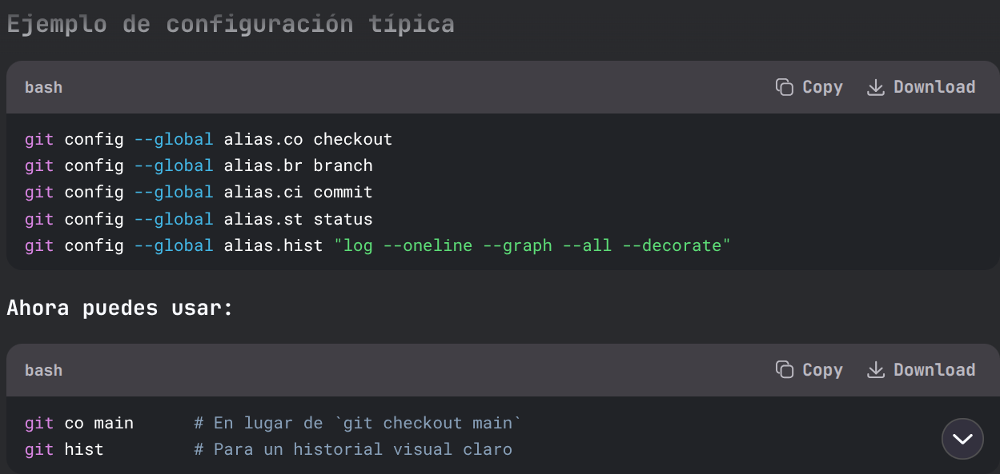

## 📌 Introducción general

Estas notas están pensadas para reunir lo más importante sobre **Git** y **GitHub**, dos herramientas clave en el mundo del desarrollo. Git nos permite llevar un control preciso de los cambios en nuestros proyectos, mientras que GitHub facilita el trabajo en equipo y la colaboración en línea.

➡️ Aquí vas a encontrar **explicaciones con ejemplos, analogías y comandos prácticos** que ayudan a recordar mejor el funcionamiento de estas herramientas, especialmente útil si estás empezando o necesitas repasar.

> ✏️ Estas notas no son formales ni académicas. Son apuntes que armé por mi cuenta mientras aprendía, explicados como me hubiera gustado que me los explicaran.

### 🔍 ¿Qué contiene este repositorio?

- 📖 Introducción conceptual a Git y GitHub
- 🧠 Comandos esenciales con explicaciones claras
- 🌿 Gestión de ramas, stash, tags, reset y reflog
- 🔐 Autenticación con SSH en GitHub
- 🤝 Uso de Pull Requests, forks y buenas prácticas
- 💡 ¿Por qué hice esto?

Aprender Git y GitHub desde cero puede parecer intimidante. Esta guía nace de mi propia necesidad de comprenderlo todo de forma simple, visual y útil. Lo comparto por si alguien más encuentra aquí algo que le sirva o le ayude a entender mejor.

### 🧩 Recomendado para:

- Estudiantes de desarrollo web o software
- Personas que están iniciando en proyectos colaborativos
- Developers que quieren tener una guía de repaso práctica

### ✅ ¿Qué hace especial a esta guía?

✅ Está explicada con ejemplos simples y reales

✅ Usa analogías para facilitar la comprensión

✅ Tiene un enfoque minimalista y directo

✅ No está sobrecargada con teoría innecesaria

---
## Introducción a Git

### Concepto de Git

**Git** es un **sistema de control de versiones distribuido**. Esto nos ayuda a **documentar** y **trazar cada uno de los cambios**  que nosotros como desarrolladores realicemos.

> **Ej:**  Funciona como los **mensajes de WhatsApp**, en donde nosotros podemos ver todos los **mensajes anteriores**.


Git es un sistema de control de versiones distribuido **diseñado para rastrear cambios** y **coordinar** el **trabajo colaborativo** en proyectos de software.

### Conceptos clave de Git

- **Control de versiones:** **Registra el historial de cambios en archivos**, permitiendo **revertir**, **compartir** y **recuperar** versiones anteriores.
- **Distribuido:** **Cada desarrollador tiene una copia** completa del repositorio, lo que **permite trabajar sin conexión** y facilita la redundancia

> **NOTA:** Sistemas operativos como LInux y MacOS ya tienen Git instalado por defecto aún que puede que no sea la ultima versión.

### Comandos de Git

> **NOTA:** Como recomendación, hay que habilitar la opción de poder visualizar los archivos y carpetas ocultos en nuestro sistema operativo.
> 
> En Linux se hace con `Ctrl + H`.

- `git init`: Inicializa un repositorio con la herramienta de Git.

> **NOTA:** Cuando en un directorio nos encontramos con un **directorio oculto** `".git"` eso quiere decir que **ese directorio ya a sido** o esta siendo **trabajado** con el **control de versiones de Git**.

#### Ramas en Git

La rama **master o main**  es la **rama base** sobre la cual esta **montada el proyecto principal**.

- `git add`: Nos permite **agregar archivos y/o carpetas** a nuestro **proyecto principal** inicializado en Git.
- `git commit`: Nos permite **subir/insertar el cambio realizado** con su respectivo identificador.
- `git status`: Nos permite **evaluar el estado actual del  repositorio** (archivos modificados, en **Staging Area** [listo para commit], no rastrados [untrancked]).
- `git log`: Nos **muestra el historial de commits** (autor, fecha, mensaje y hash) en un **orden cronológico inverso** (más recientes primero).
	- `git log --graph`: Incluye un gráfico de las ramas.
- `git checkout`: Nos sirve principalmente para:
	- **Cambiar de rama**.
	- **Restaurar archivos** a un estado anterior (sin afectar  commits).

```bash
git checkout "nombre-de-rama"
git checkout "nombre-archivo"
```


- `git seter`: Nos permite **deshacer cambios en diferentes niveles**.
	1. Quitar archivos de Staging Area (sin borrar los cambios).
	2. Eliminar commits locales.

```bash
git reset --soft HEAD~1
```

**Deshace le ultimo commit** pero mantiene los cambios en Staging Area. 
**Utilizado para reescribir un commit** (olvidaste incluir archivos).

### Alias en Git

Los **alias** en Git son **atajos personalizados** que puedes crear para comandos largos o usados frecuentemente.

##### ¿Para qué sirven?

- Acortar comandos complejos.
- Evitar errores de tipeo.
- Automátizar tareas repetitivas.

##### ¿Cómo puedo crear un alias?

###### Sintaxis
```bash
git config --global alias.nombre-del-alias "comando-original"
```
##### ¿Cómo ver todos los alias existentes?

```bash 
git config --get-regexp alias
```

##### ¿Cómo eliminar un alias?

```shell
git config --global --unset alias.nombre-del-alias
```

###### Ejemplo de la creación de alias típicos


### .gitignore

El archivo `.gitignore` es un archivo de texto que **le indica a Git que archivos o directorios debe ignorar en el repositorio**.
Es especialmente útil para **excluir archivos generados** **automáticamente**, **temporales** o **sensibles** que no deben incluirse en el control de versiones.

> **Ej:**
> ```txt
> # Igonorar archivos log
> *.log

##### ¿Donde se coloca?

- **En la raíz del proyecto.**
- También puedes tener archivos `.gitignore` en subdirectorios para reglas especificas.

####  git diff

- `git diff`: Nos permite **visualizar todos los cambios realizados** que **no** hayan sido **guardados** en el **Working Directory**.
- Muestra las modificaciones actuales (sin usar `git add`).
- Es **ideal para revisar que cosas se han editado antes de** preparar archivos para **hacer** `commit`


 <p style="color: #E3170A; font-weight: bold;">- : Lineas eliminadas (rojo en la terminal)</p>
<p style="color: #70EE9C; font-weight: bold;">+ : Lineas añadidas (verde en la terminal)</p>

### Desplazamiento en una rama (Moverse entre commits)

En Git el desplazamiento en una rama **se refiere a moverse entre diferentes commits** dentro del historial de una rama.

Esto **permite inspeccionar, modificar o recuperar estados  anteriores** del proyecto.

##### 1.- Conceptos clave
- **HEAD:** Es un **apuntador que indica tu posición actual** en el historial.
- **Rama (Branch):** **Secuencia lineal de commits** que representa una linea de desarrollo.
- **Commit (HASH):** **Identificador único que representa un estado guardado** del proyecto (Ej: **a1b2c3d**).

##### 2.- Comandos para desplazarse

- `gig checkout`: **Permite moverse a un commit en especifico** (sin modificar la rama). 

```bash
git checkout "hash-del-commit"
```

Para **regresar** a tu **rama principal** 

```bash
git checkout "nombre-de-la-rama"
```


#### Git reset --hard & Git reflog

- `git reset --hard`: **Borra todo lo que no esta guardado en un commit**.
	- Cambios en tus archivos
	- Commits recientes
**Puedes mover tu rama a un commit anterior** (es como retroceder en el tiempo).

##### ¿Cuándo usarlo?

- Cuando quieres **hacer commits locales**.
- Cuando todo esta tan mal que quieres volver a un punto seguro.
```bash
git reset --hard "hash-del-commit"
```

- `git reflog`: **Muestra todo lo que has hecho en git** (incluso lo que borraste).

##### ¿Cuándo usar git reflog?

- Si borraste un commit por error (con `git reset --hard` o `git rebase`).
- Si usaste un `merge/rebase` y todo se rompo y quieres volver atrás.
- Si accidentalmente borraste una rama y necesitas recuperar su ultimo commit.

###### ¿Cómo usarlo?

**Situación:** Borraste los dos últimos commits con `git reset --hard HEAD~2` y te arrepentiste.

1. Usa `git reflog` para encontrar los últimos `hashes` de los commits borrados.
2. Selecciona el `hash` del commit al que quieres volver (Ej: f4e5dec)
3. Recuperalo con:

```bash
git reset --hard f4e5dec
```


### Tags en Git

##### ¿Qué son las Tags en Git?

Los **tags son como "marcadores"**  o "versiones oficiales" **que se colocan en** commits específicos para señalar **puntos importantes en el historial del proyecto**  (Ej: lanzamiento de la versión como **v1.0.0**, **v2.3.0**).

##### Analogía

Imagina que tu proyecto es un libro. Los **commits son las páginas** y los **tags son "post-it"** pegados a páginas clave como "Capitulo 1" o "Edición FInal".

###### Tipos de Tags

- **Lightwight Tags**
		Son etiquetas simples (solo un nombre apunto a un commit).

```bash
git tag V1.0.1
```

- **Annotated Tags**
		Incluyen metadatos (autor, fecha, mensaje descriptivo y firma PGG)

	<div style = "border: solid 1px; border-radius: 15px; padding: 10px; display: column;">
	<p style="color: red; font-weight: bold;">IMPORTANTE!</p>Recomendado para versiones oficiales.
	</div>

```bash
git tag -a V2.0.0 -m "mesanje"
```

> NOTA: Con **Git tag** **podemos ver todas nuestras etiquetas** creadas.

### Ramas en Git

Las ramas en Git **son lineas de desarrollo independientes** que **permiten trabajar en diferentes características, creaciones o experimentos** sin afectar el código principal.

##### Analogía 
```txt
Imagina un árbol.
- El tronco principal (main o master) es la versión estable.
- Las ramas son derivaciones donde puedes probar cosas nuevas sin romper el tronco.
```


##### ¿Cómo funcionan?

1. **Cada rama apunta a un commit** especifico.
2. Los cambios de una rama son **aislados: No se afectan otras ramas hasta que se fusionan (merge).
3. **Puedes crear, eliminar o fusionar ramas** en cualquier momento.

##### Comandos esenciales

1. `git branch` (gestiona ramas)
	Se pueden **ver**, **crear** o **eliminar ramas**.


| Comando                       | Descripción                                          |
| ----------------------------- | ---------------------------------------------------- |
| `git branch`                  | **Lista todas las ramas** (indica la actual)         |
| `git branch "nombre-rama"`    | **Crea** una **rama nueva** (pero no cambia a ella)  |
| `git branch -d "nombre-rama"` | **Borra** una **rama local** (si ya fue fusionada)   |
| `git branch -D "nombre-rama"` | **Fuerza** el **borrado** (aunque no este fusionada) |
2. `git switch` (cambia entre ramas)

	**Moverse entre ramas** existentes.


| Comando                       | Descripción                                      |
| ----------------------------- | ------------------------------------------------ |
| `git swith "nombre-rama"`     | **Cambia** a la **rama** especificada            |
| `git switch -c "nombre-rama"` | **Crea** una **rama nueva** y **cambia a ella**. |
3. `git merge` (fusionar ramas)
	**Combina** los **cambios de una rama** a **otra** (Ej: traer "login" a "main")
##### Pasos típicos

1. **Posicionarte en la rama destino** (Ej: "main")

```bash
git switch main
```

2. **Fusionar la rama deseada**.

```bash
git merge login
```

### Stash en Git

##### ¿Qué es el Stash en Git?

El **stash** es un "cajon temporal" donde **git guarda cambios no guardados** (en el Workging Directory o en el Staging Area) **para que puedas cambiar de ramas sin perder los cambios**.

###### Analogía
```txt
Imagina que estas escribiendo un documento y alguien te interrumpe. En lugar de guardarlo como versión final (_commit_) lo dejas en un post-it (_stash_) para recordarlo más tarde.
```

###### Comandos esenciales

1. `git stash`: (**guarda** cambios temporales)
		**Gurda todos los cambias no commitados** en el stash.


| Comando           | Descripción                                 |
| ----------------- | ------------------------------------------- |
| `git stash`       | **Guarda archivos temporales**              |
| `git stash -m ""` | **Guarda con** un **mensaje personalizado** |
2. `git stash list` (Ver todos los stash guardados)
		**Muestra** una **lista de stash** (guardados como pilas: El ultimo en entrar es el primero en salir).
3. `git stash apply` (Recuperar cambios)
		**Recupera** los **cambios del stash sin borrarlos de la lista**.

```bash
git stash apply
git stash apply "id-stash"
```

4. `git stash pop` (Recupera y borrar)
		**Recupera los cambios** y **elimina el stash de la lista**.

```bash
git stash pop
git stash pop "id-stash"
```

5. `git stash drop` (Elimina un stash)
		**Elimina** un **stash especifico sin aplicarlo**.

```shell
git stash drop "id-stash"
```

6. `git stash clear` (Elimina todos los stash)
		**Elimina todo el contenido** de la sección de los stash.

```shell
git stash clear
```

---

## Introducción a GitHub

### ¿Qué es GitHub?

**GitHub** es una **plataforma en la nube basada en Git** que sirve como **hub** (_centro_) para **alojar**, **gestionar**, **colaborar en proyectos** de desarrolladores de software.

Su **concepto principal** es el de ser el "Facebook de los programadores" en donde **equipos** y **comunidades comparten código**, **resuelven problemas** y **construyen software** juntos.

### Concepto principal

"Colaboración y control de versiones en la nube"

**GitHub extiende las capacidades** de Git (que es local) **a un entorno remoto** y social.

### GitHub nos permite

- **Almacenar repositorios Git en la nube**
- **Facilitar el trabajo en equipo**
- **Integrar herramientas de automatización de pruebas y despliegues**

### Funciones clave de GitHub
- **Repositorio remoto:** Guarda tu código en la nube
- **Pull Requests (PRs):** Proponer cambios y revisar código antes de fusionarlo
- **Issues:** Gestionar tareas, logs y mejoras
- **GitHub Actions:** Automatizar flujos
- **GitHub Pages:** Hosting gratuito para sitios web estaticos
- **Forks y contribuciones:** Copiar repositorios de otros devs, modificarlos y sugerir cambios

#### Diferencias clave entre Git Y GitHub

| Git                                                                                                                  | GitHub                                                                                                        |
| -------------------------------------------------------------------------------------------------------------------- | ------------------------------------------------------------------------------------------------------------- |
| **Sistema de control de versiones** que **permite mostrar cambios** en archivos y **coordinar el trabajo** en equipo | **Plataforma en la nube basada en Git** que ofrece **alojamiento de colaboración** y **gestión** de proyectos |
| Es un **software local** (se instala en tu computadora)                                                              | Es un **servicio en la nube**  (requiere conexión a Internet)                                                 |
| Creado por **Linus Torvalds** (_2005) para el **desarrollo del kernel de LInux**                                     | Fundado en 2008 (adquirido por MIcrosoft en 2018)                                                             |
#### Funcionalidad principal

| Git                                                                                  | GitHub                                                                     |
| ------------------------------------------------------------------------------------ | -------------------------------------------------------------------------- |
| **Control de versiones local:** Guarda el historial de cambios en tu maquina         | **Almacenamiento remoto:** Guarda repositorio Git en la nube               |
| **Ramas, merge y commits:** Trabaja en diferentes versiones del proyecto             | **Pull Request y Code Review:** Permite revisar código antes de fusionarlo |
| **Trabajo Offline:** No necesitas Internet para usar Git                             | **Colaboración en equipos:** Issues, proyectos, wikis y discusiones        |
| **No tiene interfaz gráfica nativa:** Se usa por consola o por clientes como Git GUI | **Interfaz web intuitiva:** Facilita la navegación y gestión de proyectos  |
### Protocolo Secure Shell (SSH)
[Notebook de SSH](https://notebooklm.google.com/notebook/a13bf044-360a-4106-ae88-2b1fccf1bc2e)

El **Protocolo Secure Shell (SSH)** es un **protocolo criptografico de red** diseñado para **operar servicios** de la red de **manera segura** sobre una **red no segura**.

Fue creado e 1995 por **Tatu Ylone** para **remplazar protocolos inseguros** como **Telnet** o **RSH**, que **transmiten credenciales de autenticación** (como usuario y contraseña) en **texto plano**, lo que significa un riesgo significativo de intercepción de terceros.

#### 1.- Seguridad y el "Túnel de Cifrado"

La seguridad fundamental de SSH **radica** en sus **mecanismos de cifrado**, que **oculta el contenido de transmisión** de cualquier observador.

Este proceso crea un "túnel seguro" o cifrado donde toda la transmisión (comandos, datos o autenticación) viaja de manera incomprensible para un interceptante.

Este **túnel seguro** se **establece** generalmente sobre el **puerto TCP 22** el cual esta **asignado** y es el **puerto de escucha estándar** por los **servidores SSH**.

El puerto 22 es la "puerta de encuentro", mientras que el "túnel" es la conexión cifrada que se forma a tráves de él.

#### 2.- Autenticación basada en claves

A diferencia de los métodos tradicionales de usuario y contraseña, SSH utiliza la criptografia de clave pública para autenticar tanto al equipo remoto (servidor) como al usuario.

Este método implica el uso de **un par de claves** (o llaves).

- **Una clave privada:** Se genera en tu computadora local y debe mantenerse **estrictamente confidencial**. Es crucial que esta clave privada **nunca se transfiera a través de la red** durante el proceso de autenticación.
- **Una clave pública:** Se genera junto con la privada y se comparte con el servidor remoto (en este caso GitHub). El servidor la utiliza para verificar que posees la clave privada correspondiente, sin requerir que esta ultima se transfiera.

#### 3.- Evolución del protocolo

- La primera versión se llamo **SSH-1**.
- Luego vino **SSH-2** que es la que se usa hoy en día y es mucho más segura y mejor.

La versión 1 se considera vieja y con fallas de diseño, por eso es mejor evitarla.

#### 4.- ¿Cómo GitHub utiliza SSH para autenticación?

GitHub utiliza el protocolo SSH para permitir a sus usuarios **conectarse** y **autenticarse** con sus repositorios sin la necesidad de proporcionar su **nombre de usuario** y un **Personal Access Token** (PAT) en  cada visita.

Por ello, el **usuario debe generar un nuevo par de claves SSH** (privada y pública)en su equipo local y **añadir** la clave SSH pública a su cuenta de GitHub.

Al intentar conectarse (Ej: para realizar un "push") tu cliente SSH y el servidor de GitHub realizan un **desafió criptografico** para verificar la posesión de la clave privada correspondiente a la pública registrada, sin que la clave privada abandone el sistema.

Una vez autenticado, se establece el túnel cifrado para la comunicación.

### Comandos git fetch y git pull
Estos comandos se usan para **organizar tu repositorio local con los cambios del repositorio remoto** (como los que están en GItHub). Pero funcionan de manera diferente.

#### 1.- git fech
##### Descarga los cambios (verifica si hay nuevos cambios)
**Descarga los cambios** más recientes **del repositorio remoto** (en GitHub) **pero no los aplica en tu código local**.

Dicho de otra manera:

**Descarga** en local **el historial de cambios**, **pero sin descargar** los **cambios**
Esto **nos permite comparar los cambios antes de fusionarlos** (merge).

#### 2.- git pull
##### Descargar y aplicar cambios

**Descarga los cambios del repositorio remoto** (fetch) **y los fusiona** (merge) **automáticamente en el** repositorio **local**.
Es como un `git fetch` y un `git merge` en un solo comando.

#### ¿Cuándo se usan?
- Cuando quieres **actualizar tu rama local con los últimos cambios de GitHub**.
- Si **estas seguro de que** los cambios remotos **no generan conflictos** con tu trabajo.

### Comando git clone

Se usa para **copiar un repositorio remoto**, y **descargarlo** en tu **computadora local**.
Es la forma más rápida de comenzar a trabajar con un repositorio existente.

###### Sintaxis
```shell
git clone "url-repo-original"
```
### Comando git push

Se usa para **enviar los cambios confirmados** "commits" de tu **repositorio local, al repositorio remoto** (GitHub).

Es tu manera de compartir tu trabajo con el equipo o guardar una copia en la nube.

###### Sintaxis básica
```shell
git push "nombre-del-remoto" "nombre-de-rama"
```

### ¿Qué es un Fork en GitHub?

Un **fork** es una **copia personal de un repositorio de otro usuario** en la cuenta de **GitHub**. Te **permite experimentar, modificar** y **contribuir** al **proyecto original** sin **afectarlo directamente**.

##### Analogía
```txt
Imagina que el repositorio original es un libro en una biblioteca pública.
Hacer un fork es como fotocopiar el libro para tomar notas y hacer cambios en tu copia.
Luego, puedes sugerir tus cambios al autor original (Pull Request).
```

![[Diagrama-Fork.png]]


### ¿Qué es un Pull Request (PR) en GitHub?
 
Una **Pull Request** (o un PR) **es una solicitud par fusionar tus cambios** (en una rama o en un fork) **con un repositorio principal**.

Es el **mecanismo central** para **contribuir a proyectos en GitHub**, ya sea en **equipo** o en **código abierto**.

###### Analogía
```txt
Imagina que el proyecto principal es un documento compartido (como un Google Doc).
Tú hace una copia, editas una sección y propones tus cambios al dueño del documento.
El dueño revisar los cambios y decide si los acepta (merge) o rechaza las modificaciones.
```

#### Tipos comunes de PRs
##### **1.- Contribuciones a Open Source:** 
Haces un fork, modificas y envías un PR al proyecto principal.
##### **2.- Trabajo en equipo:**
Creas una rama (feactures/login) haces cambios y haces revisión.
##### **3.- Corrección de bugs:**
Solucionas un error y lo propones vía PR.
#### Buenas practicas para  PRs efectivos

- **Títulos descriptivos:** 
		Ej: "Corrección en el formulario login"
- **Descripciones detalladas:**
		Explica qué, por qué y cómo se hicieron los cambios.
- **PRs pequeños:**
- Enfocate en un solo cambio (Ej: un bug o feature). Es más fácil de revisar.

